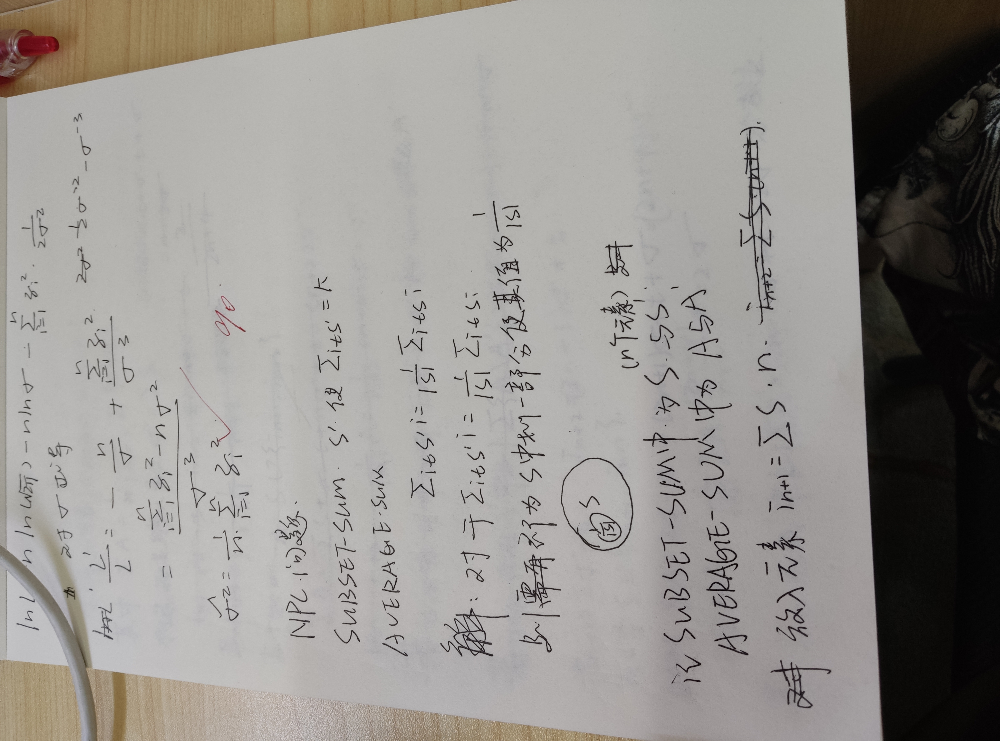
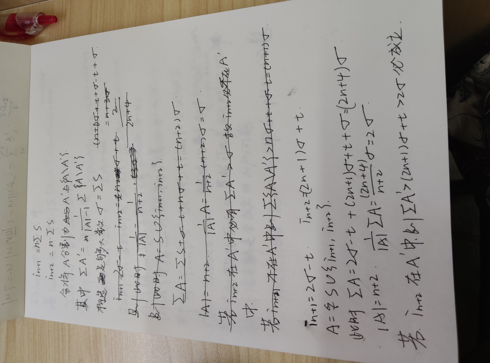
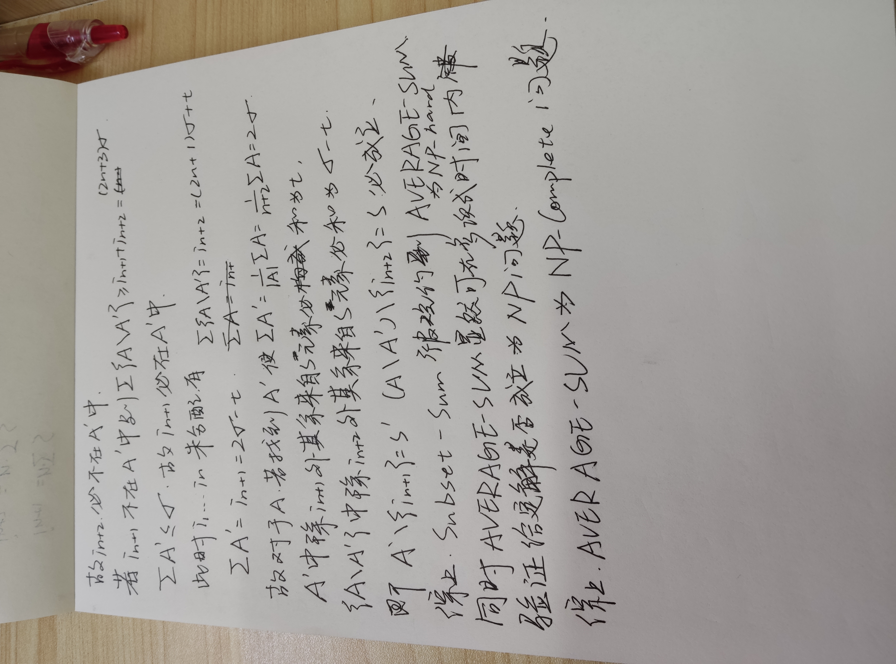

# 上海科技大学初试备考指南

本经验贴适合 2024 年考研（2023.12.24）情况，因为随着时间的推移硕士招生考试在考察体系设计、考试内容等方案上可能会有改变。兵无常势，水无常形，读者作为考生也要因地制宜来制定备考策略。

## 考试科目准备

### 思想政治理论

政治备考有一个相当大的误区就是认为其是一门严格要求背诵的学科，以至于在备考过程中花费大量时间从头至尾背诵知识点。从笔者了解来看，耗费大量时间在政治科目背诵上的考研生并没有在政治分数上获得显著性的优势，但是对其他学科复习时长的挤压却是严重的。

上海的政治科目有压分的现象，所以只要考试分数在 60，65 及以上区间中即为正常水准。想要进一步提高政治分数，将会迎来强烈的边际效应。如果考虑自己的总分仍不足达线，那么就应当考虑在 991 或数学上找回更多分数。

一个标准的达线分数：政治 60，英语 60，数学 70，数据结构与算法（991）90。此时总分为 280，达线分数为 273（2023 年），基本达到过线要求。

笔者去年政治分数 71（水区广东），今年政治分数 75（旱区上海）。所以说政治分数还是相对稳定的。从个人经验来看，决定政治分数的主要因素确实不是对知识点极其高标准的背诵，而是对其内在原理与历史事实的理解，在复习过程中培养的「题感」。

从始至终，我使用的资料及复习安排如下：

1. 九月报名前后，政治复习开始；
2. 刷《肖秀荣一千题》，配合张修齐《一千题手册》与《小橙书》；
3. 刷《肖秀荣八套卷》，配合张修齐《肖八手册》与《小橙书》；
4. 刷《肖秀荣四套卷》，配合张修齐《肖四手册》与《小橙书》；
5. 背诵张修齐十张纸与最后的冲刺资料。

即使使用相同的资料，复习效果也可能有非常大的不同。所以我也特地补充说明：

1. 九月开始复习政治在时间紧张的情况下完全可以，但是如果基础比较薄弱可以在四五月份开始听一些强化课。**非常不建议在九月以后还在每天看时长很长的课，比如徐涛强化课。**
2. 根本不用先学背知识点再闭卷刷一千题。直接对着一千题手册刷一千题，把小橙书没有的知识点补充在小橙书上。边刷、边学、边理解。
3. 进一步讲，要明白政治理论 **不是一门靠刷题的科目。** 所以在整个复习过程中会有非常多反常识的地方。《一千题》本身其实是一本帮助学习背诵的资料而不是自己背完后写的习题集。复习考试不能只面向知识点，更要面向题型。政治客观题型的核心在于「理解、再认」，即对于马原哲学的理解与套用和对于史纲的准确再认，而不是默写。**而默写与再认对背诵程度要求的差异是显著的，在备考上花费时间的区别是巨大的。** 尤其我们还有复习数学一与数据结构算法的任务。除此之外，肖八的分数依旧没有任何参考意义，因为它只是一本用来补充一部分时政与划重点的资料；真正具有一定模拟卷性质的只有肖四，其参考意义也比较有限。我依然只是对着手册刷了一下，留意了重点题，因为已经有分析题模板所以也没背肖八肖四的分析答案。
4. 其实每年考察相当大的部分就是时政。习概就是时政，时政就是习概。即使是今年新出的一本书（实际上是从原先毛中特拆出去的），笔者完全没有刷一千题习概部分，完全没有背诵任何除时政外习概知识点，完全没有刷肖秀荣背诵手册习概部分的题目。
5. 政治不同板块的学习方法与刷题方法也不同。马原重在理解，要明白错误的选项是怎么错的，史纲重在再认，做题时多看对的少看错的。通过做一千题，可以把政治知识框架基本串联下来，还会对考察方式有一个基本的认识，复习效果是不错的。
6. 如果要追求较高分数，那么一定要对马克思主义哲学原理有比较深刻的理解，以及明白它在史纲、毛特中是以什么样的形式体现的。这并不是说要死记硬背有哪几个原理然后报菜名，而是要理解以事物在矛盾中演进的模型为核心的认知与实践方法。笔者是因为自己之前作为业余爱好自学过一些很浅的哲学知识与哲学史。虽然现在基本忘光了，但是留下来的一些基本命题讨论的习惯与印象还是对政治学习有所帮助。

即使是这样，作为一门文科我也没法保证再考一次试依旧拿高分，更不会押宝花费大量时间在其上，追求多高的分数。在我的备考计划中，这就是一门通过性的科目，必须过关的科目，而不是为我带来选拔性优势的科目。政治的核心策略是 **尽可能少花时间拿尽可能拿的分数，「事半功倍」。**

### 英语（一）

上海的英语科目有压分的现象，所以只要考试分数在 60，65 及以上区间中即为正常水准。除此之外，英语科目拿分的大头一定是客观题。

考研英语阅读部分有一个非常显著的特征，就是它的文章并不是由命题组撰写，而是从一些题源期刊摘下来的文章。换而言之，考研英语阅读考察的就是考生在原生英语阅读环境中理解和提取信息的能力。

从笔者经验来看，**任何英语考试科目的准备中词汇量是核心。** 在十一月以前我的英语复习内容主要是每天背诵考纲单词。我使用的软件是「不背单词」，只背如何认不背如何拼写，因为英语阅读的要求也仅有再认水平。

背单词的方法很重要，关键在于要符合我们人脑的认知曲线与认知规律。也就是说如果要花 20 分钟才能完全强记住某个单词，不如分成二十天每天花一分钟去背它。我使用不背单词刷词的速度是很快的，每天大概半小时但是能最多能刷一百多个单词。看到单词立即反应过来点「熟悉」，需要思考一会点「模糊」，完全不认识点「不认识」。接着就刷下一个单词，不要在单个单词上停留太多时间强记。这样背单词的效果是很好的，我猜测是因为因为我们人类学习与认知语言的方式就是在几个月几年里多次反复短时间刺激大脑，而不是专门一次性记忆希望永远不忘。

再一个就是解析长难句的方法。学习英语的同学基本可以划分为两类，即学习语法理解文章句段的同学与靠语感理解文章字段的同学。我认为想要达到原生英语阅读者的程度就必须完成前者为主到后者为主的转换。刚上大学时我的英语水平测试仅有 B 级，可以说在同学间没有任何出众的地方。但是由于学习编程不得不反复阅读英文文档，浏览英文社区，提 ISSUE 与写回答等，所以原生的英语理解能力得到了比较大的发展。除此之外，我在平时还通过不用中文字幕仅用英文字幕看了全季的《Futurama》飞出个未来（一开始肯定很痛苦难理解，但是只要坚持下去进入找到感觉就会顺利些），会在油管上看一些技术视频。总之要把自己放在英语原生环境中刺激大脑启动语言功能，因为任何一门正在被使用的语言一定是经过几千年演进后变得 Human-Brain-Friendly 的，如果不得门路可能是还没开窍。一旦进入那种适应英语环境的状态你也会惊讶自己原来如此擅长英语。

> 可以这么粗略的比喻，我们大脑里有用来学习各种学科的逻辑思考区域与用来支撑语言功能的语言区域，如果通过逻辑思考区域来把英语当成一门学科学的话就是软件解码，但是语言区域里会为语言解析提供硬件加速。所以这个适应的过程就相当于给自己装驱动，从在通用计算单元上软解变为使用专用计算单元硬解。

但是总的来说，在考研备考的时间里想要大幅提升「英语素养」这件事是不容易的，不过我们可以背单词。不管考生在备考时的英语水平如何，都可以通过背单词来提高自己的英语分数。这是一个非常稳定的方法。而如各种阅读技巧课语法课等，一方面占用了大量时间，另一方面甚至并不能保证对分数有绝对正向的提升，甚至错误地使用方法、技巧可能反而一叶障目，起到反效果。

所以，我认为英语的核心备考任务是背单词，并尽量以不影响其他课程复习的方式提升自己的语感，塑造一些语言环境。比如把手机电脑的语言设置成英语，或是闲暇的时候看一些英文视频或者题源报刊。**英语备考的关键词是「细水长流」。**

### 数学（一）

前文讲到前两门科目的复习与备考规划有一种能挤压多少时间就挤压多少时间的感觉，这当然是有原因的。因为对于我们专业的考研备考来说，数学与 991 科目的复习效果与考试分数基本上对于能否过线有决定性意义。除此之外，这两门科目的复习也是极其具有系统性和复杂性的。直白地讲，就是英语和政治即使大概看一看去裸考，也不会比未复习低出大量的分数，甚至复习一年的提升也就是几分、十几分这样子；但是数学如果不完整地一轮一轮复习，对于概念没学会、题型没掌握、题目没刷熟，那么考场上就是想破脑袋也做不出来，往往会失去大几十的分数。而如果是一些体育或文科的考研生，其专业课可能拉不开差距，就不得不回去多看政治和英语。所以说考研备考一定要考虑自己的实际情况，专业的实际情况。

我的数学课全程跟的张宇老师，因为他的书课包会送网课。基础 30 讲一轮，每讲听完做课后题、300 题，强化 36 讲一轮，每讲听完做一遍例题。其实应该刷一遍一千题，但是我由于时间太紧张也没刷，接着就是从 03 年开始历年真题和张宇 8 套卷以及张宇 4 套卷，到临近考试时真题与模考题穿插做。

我做了一些其他老师的题（李林），但是感觉怪怪的。可能是我在前面没有跟着李老师的课。不过对于张宇卷子的模考效果还是比较满意的，实际体验上与 25 号做的那张卷子风格相似。并不是说命中题型，而是说那种陌生题型的编题思路与解题思路的考察方式。可能会有人觉得张宇模考卷子或者其他老师的模考卷子一些题难、怪，但是上考场以后我们会发现那张考研真题卷也一样有许多没见过的题型。我们觉得历年真题题型「正常」，不如说那些题型其实都在一轮、二轮的复习里的例题或者课后题做过了，所以我们才会觉得那些题熟悉，不难、不怪。

但是不管怎么样，你用的是张宇、汤家风还是李林或者其他名师的课，数学的学习注定没有捷径可走，而且任务量庞大。非要说有什么心得，就是要多思考，多理解，多品味。可以说对于我们非数学专业的同学，考研复习可能也是此生最后一次系统学习数学基本科目，体会数学之美的机会了。Bilibili 上有一位 UP 主叫 3Blue1Brown，他的视频刚好覆盖数学一的三门课程。你可以在微积分系列中感受无穷大与无穷小的奥妙，在线性代数课程中领会方程、向量空间与图形变换的精巧，在概率论课程中欣赏大数定律与中心极限定理的神奇。这些课并不会直接教授题型与解题方法，但是你会感觉到平时里许多题型背后处处在考察你对数学概念生动、灵活的掌握。

从考察目标与出题角度来分析，我对三门课程的理解是这样的：概率论可以算是一种「学术工具」性质的课程，因为考研有数学一科目的同学往往会在研究生阶段参与科研工作，所以需要考察对数理统计的掌握能力。但是高等数学和线性代数的门道就多一些。我认为高等数学核心中的核心是真正掌握一系列「无穷小」的概念，并通过这种能力来算极限，以及基于极限的一系列知识。

而线性代数则隐藏着更深的坑。线性代数部分对于数学一考生有一个特别考点是「向量空间」。可是实际上，我个人体会到掌握从向量空间的角度来看线性代数问题的解法对于这部分题型的解题能力有质的提升。在大二学习线性代数时我靠老师捞才刚刚及格，因为我一直感觉矩阵、对角化、矩阵变换、特征值与特征向量等等知识都只是在庞大计算中来回颠倒符号，更不用说还有数不尽的性质要背。但是理解向量空间后一切都变得焕然一新，原先麻烦的性质也变得符合直觉。甚至你会发现原来一些偏题、怪题其实是想考察你对向量空间的理解与运用，但是这些题不管从命题还是答案上都憋着不说。线性代数的特点就是性质很多、工具很多，特征值与特征向量的一系列性质，矩阵倒来倒去的各种方向，我们不是不会，而是不知道该怎么用。此时向量空间就是指明我们前路的灯塔了。

不积跬步无以至千里，不积小流无以成江海。即使好像悟了很多但是不做题绝对白搭，切忌眼高手低。无穷级数中幂级数敛散性的判别，求和函数的计算，傅里叶级数的使用，或者是微分方程中一系列的解题步骤，各种复杂的积分与求导公式，三重积分与两类曲线曲面积分，这些都不是仅靠理解就能掌握的，而是不停地刷题。微分方程、曲线曲面积分很难步骤不知道怎么写，刷 20 道以后你会发现这些都是张宇说的「规定动作」，是拿分的大头。其实考完试后算分，我的选填分数并不是很高。但是幸好有两道复杂计算积分的大题竟然算对了最后答案。

除此之外一定要在十月份开始做套卷。一轮一轮地过会前面学后面忘，只有把套卷做下来才能形成应试能力，串联知识。这个过程是很痛苦的，我一开始做零几年的真题一套可能只有 58 分，然后复盘、总结、刷题型，一步一步到 70 多分、80 多分，直到第一次模拟 130 分感觉特别高兴（当然是可能做到相对简单的卷子，模考很多时候分数没意义）。

所以说数学是一门很累的科目，可以说占我们复习时间的 70% 也不为过。既要理解深刻，又要多多练习，还要一直维持状态。可能每天学习感觉自己进步都很微弱，甚至有点退步，做几张奇怪的模拟卷就破防了。但是如果认真对待这门科目，日日坚持最终成绩一定是可以接受的。**数学的学习就是「汗流浃背」。**

### 数据结构与算法

数据结构与算法是上科大的自命题科目，也是另一个拿分的大头。我一开始没有决定考哪里，所以学的还是 408 的内容。幸好决定考上科大时刚好学完数据结构，开了一章操作系统。总之说一下我复习了哪些资料：

1. 我在 7，8 月份首先跟着邓俊辉在学堂在线上开的公共系列课《数据结构》学了一遍，配他的课本。这是一本可以公开下载的课本，但是我还是买了一本纸质书跟学。我觉得这门公开课从深度上讲非常漂亮，邓老师深入浅出，不是简单对常见数据结构与算法照本宣科，而是讲了许多这些算法为何如此设计的思考。他也很注重基于复杂度的算法思考方式，我觉得和上科大考察有异曲同工内容。
2. 同时每学一章，我会学习王道数据结构书上对应的章节内容，并完成课后选择题。同样也是要多思考，形成自己的解题习惯和解题能力。
3. 改考上科大以后我就开始学习其课程资料与《算法导论》。在每一章节的 PPT 开头会说明本章内容对应《算法导论》的几章几节，我会先通读算导中对应内容；接着是对课程 PPT 的理解。接着要不要再做题我没有映像了，但是感觉可以再找点对应的题做，主要是防止手生。
4. 临近考试的 11 月份底我开始刷真题，但是刷的也不多。因为历年真题比较少。在十二月份我又陆陆续续做了几张卷子，主要是想测试一下自己能不能写完整张卷子。我之前对自己 991 的期待就是 100 分就好，所以感觉只要能做完一张卷子，每道题都能做下来就可以了，没有对答案的必要（主要还是答案太难找了）。

特别要说明的是 NPC 部分的考题。虽然近年来不会出大题（如何规约），但是对于基本概念如规约方向、问题集合关系等还是考察比较多。这部分的内容算导和 PPT 上讲的都有点复杂。我建议直接看一门公开课程 [MIT 6.046J - Design and Analysis of Algorithms](https://www.youtube.com/watch?v=eHZifpgyH_4&list=PLUl4u3cNGP6317WaSNfmCvGym2ucw3oGp&index=222) 中的对应两节课程。

可以说，991 中所有关于 NPC 的选择题考的都是这张图：

 

搞懂了它你会发现那些选择题其实真的很简单，这是一定要拿到的分数。除此之外，你还会在这两节课程中学会一些基本的规约方法和问题。首先一定要搞对规约方向，接着要明白 NPC 问题实际上是一系列由这个问题是 NPC 证明那个问题是 NPC 的问题。上科大的 NPC 大题有专门的解题格式，但是我在这里写一下 21 年大题我的解题思路草稿：

这是视频课里一个规约方法的变体。草稿开始有一些错误的表述，但是后面应该是正确的。你可以理解并以标准答题步骤的方式解出这道题，当作一个练习（时隔四个月，反正在我现在已经看不懂了）。

再说一下答题方法。我答题的时候主要注意了两点。首先，991 考试对于本校考生是非常优待的，有许多题目都是在 PPT 上出现过或者讲解过的内容稍加更改。所以一定要理解 PPT 里对问题抽丝剥茧式的思考方式，并在答题时模仿。或许给阅卷老师一种熟悉感和亲切感可以提高分数。另一方面就是作为一门自命题答题一定要认真。我考试的时候 991 对于我来说比起思考工作更像苦力工作，因为我真的在拿它当政治主观题写。一般平时一个半小时就能写完一套卷，但我硬写了满满 3 小时，用了 7 张答题纸，不管会不会把算导、PPT 里能想到的相关知识有逻辑地用出来解题，给阅卷老师一种震撼感和答题纸上字里行间满满的「我真的很努力在学很想上岸咱们上科大」的暗示。毕竟没有功劳也有苦劳，看来这个策略是奏效了。

总的来说，991 的复习不必像数学工作量那样大，刷特别多的题。但是一定要听 PPT 的话，看看算导再看看 PPT，理解历年真题，一节一节地过完应该就问题不大了，**就像是数组的「循秩访问」一样。**

## 复习安排准备

### 如何履行计划

对于每门科目该怎么学，我相信每位同学都有自己的方法。这没什么问题，我认为你在了解自己的情况，在看过各种经验贴与信息后清楚基本考情，只要有章法地复习，效果都会比较好。所以我觉得更重要的是如何制定计划，如何应试。

网上有各种考研博主，你会发现他们大都似乎是自制力很强的人。每天计划制定多详细，几点到几点干什么，一天学习多少小时，简直就是自律的学习机器。但是不要因为这些表象就为自己感到焦虑。我在备考中感觉到计划就是一直在变的，起码对我来说是这样。可以首先对各个科目从考试那天倒排时间，清楚每个时间节点应该完成什么事情，然后再详细考虑自己这周应该干什么事，自己今天该干什么事。

我不太建议把计划定的很详细，否则一旦多次无法履行计划会带来很强的负面情绪和心理负担。人的工作规律就是有高峰和低谷的，这两天效率低点过两天效率高点，今天的任务可能没有按时完成但是过两天劲头大就多学点内容。**复习节奏往往不是每天「按部就班」，而是一段时间平均的「动态平衡」。** 如果你很长一段时间里感觉每天都要拖欠大量的内容，或者每天都很轻松地完成任务，那么应该去考虑重新安排自己的计划任务量。

另外，随着对每门课程复习的深入，你会对它复习的内容与任务有更深刻的认识。哪些任务比自己想象的更轻松，哪些任务其实是要花费更多时间的？或者是自己目前的复习效果其实并不好，但是通过对这门学科的一定了解后知道怎么学更科学些。当然要因此去调整计划和复习任务，边学边调整，这是一个从认知到实践，再认知再实践的无限发展和飞跃的过程。

### 学不完怎么办

复习时不管是我自己感觉到，还是据我了解别人的情况，都有一种共同的感受，那就是学不完了，真的学不完了。而且越临近考试越有这种感觉。别人数学已经在做模拟卷了，我还在复习数学第二轮（当然与此同时小红书考研博主已经复习五六七八轮了）；张宇一千题买来基本没写几道，买了各科老师的模拟卷好歹把张宇的做完了，李林的刷了两张；肖四肖八都刷的很匆忙，考试前一晚连刷三套肖四；英语真题想的是都做，但是真正临近考试连零几年的真题都没刷完，只能用几张近年真题保持语感。我记得连 991 真题还差一两张，为做数据结构买的 408 习题集考完试都是空的。可以说学的「很狼狈」。

而且越到临近考试更急躁了，每天都很焦虑，可能学习效率更低。晚上睡不着，复习扣两个小时手指头，都是发生过的事。这个时候一定不要放弃，能努一点是一点，能学一点是一点，让自己学进去以后忘记这些其实是学习以外的焦虑。有一件事可能有点反直觉，但是考研复习过的同学可能感同身受，那就是在考试前的最后一段时间，如果考生在经历大半年艰难复习后仍能保证每天仅 5 小时保质保量的复习，他已经超过了大多数人。

可以说这段时间是放弃考研的高峰期。所以我希望大家一定要坚持下去，因为你以为自己仅仅走到一半的时候，可能你距离考研成功就差最后一公里了。在 11 月一定要把除政治外的科目培养成「我明天就能上考场」的状态，因为 12 月更多是通过做卷子刷题来维持状态，而政治到了冲刺期和大幅提分期。

### 坐在考场上时

我认为和其他研友对比我最终的复习效果也只是正常水准。不管平时模拟效果怎么样，最终决定我们考研分数的还是考场上那张卷子。当坐在考场上那一刻，心态和复习时刷卷是完全不一样的。这一点在数学卷子上体现的尤为明显，首先数学一的出题风格就是会有不少新颖的题，特别是我们一开始做的选择填空部分。而此时如果静不下心来可能就看哪道哪道陌生。我的建议是大家平时刷题一定要刷一些新颖性的题目，不要只刷历年真题，这样来培养自己解题能力。另一方面是越新颖的题目，其实质考察的考点往往不会是考纲中的边边角角，而是把重点知识包装成纸老虎。不要被题目吓到，一定要静下心来，把题目拆解成自己会的知识点，然后再去解决。我觉得数学做题不是像他们讲题那样一帆风顺，而是「试」出来的。经过大量刷题后培养自己看到题目后系统解题的感觉，就是知道大概从哪几个方向试解、分析，可能一开始的方向「此路不通」，不要气馁，立马调转枪口走另一条路。关键是有底气，「虽然这个方向是错的，但是天王老子来了我也得先这么试一下」。

同理，英语、991 也是一样，因为紧张看不懂阅读，因为紧张理解不了数据结构的题。大家考试时一定要自信，仔细。我们复习了大半年一定是有能力去完成这几张卷子的，要认识到这一点。
